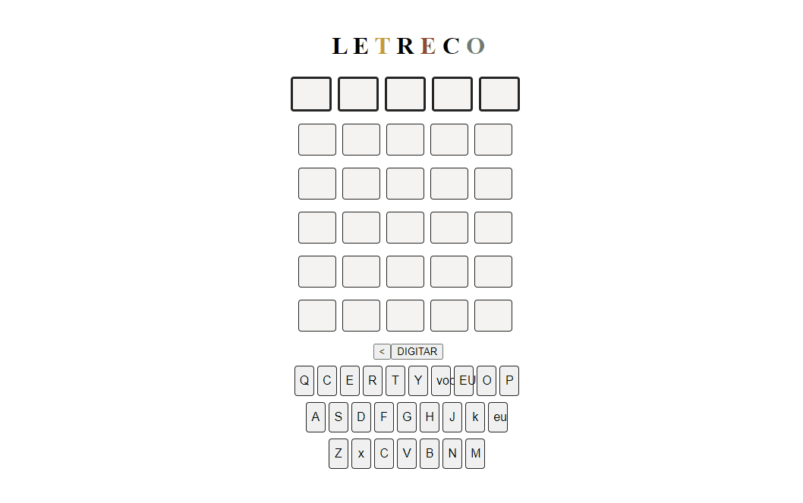

# Letreco - Jogo de Palavras

Bem-vindo ao Letreco, um jogo de palavras simples e divertido! Neste jogo, você deve acertar cada letra de uma determinada palavra .

## Como jogar

1. Para começar, escolha uma letra para começar o jogo ,
2. Use as letras para formar palavras. Clique em cada letra na ordem desejada para formar a palavra.
3. Quando você tiver formado uma palavra, clique no botão "Validar" para verificar se a palavra está correta.
6. O jogo termina quando você não consegue mais acertar a palavra com as tentativas disponiveis .

## Teste

## Tecnologias

- HTML
- CSS
- Javascript

## Importante 
Divirta-se jogando Letreco!
